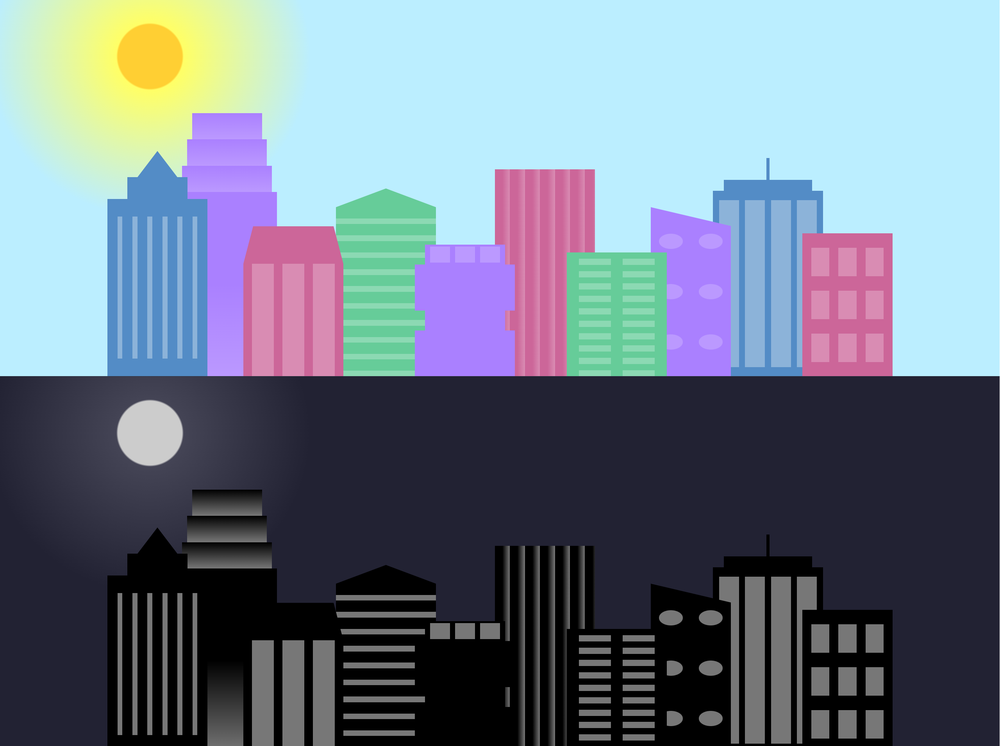

# FreeCodeCamp Course: Responsive Web Design 

<h1 align="center"> </h1>

**About this Project:**

This project is a drawing of a city skyline made using html and css, it oscillates between night and day depending on the screen resolution.
Each building is a different drawing separated by divs, so that some overlap, two classes of divs were created where one includes the front buildings and the other the ones behind.
The sun or moon were positioned this way using a radial-gradient and the closest-corner circle to 15% 15% to position itself 15% from the top and 15% from the left of the screen.

**Technologies**
- HTML
- CSS

**Course Link:**

https://www.freecodecamp.org/learn/2022/responsive-web-design/